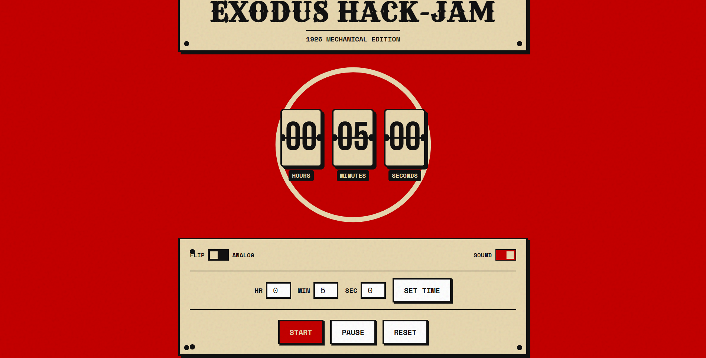
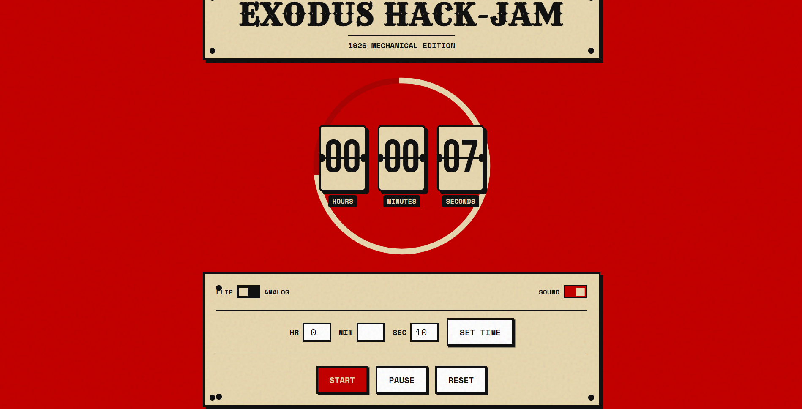
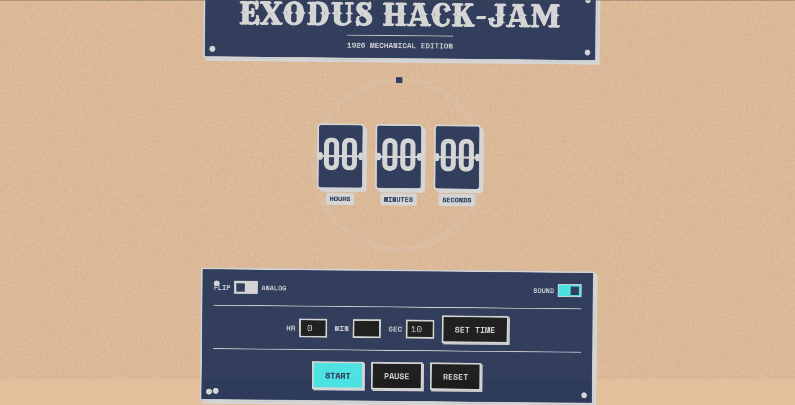
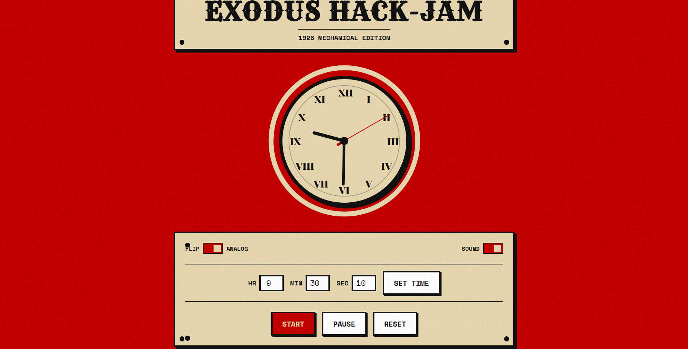

# ⏳ Exodus Hack-Jam: 1926 Mechanical Edition Timer

An immersive, skeuomorphic, and premium event timer that bridges vintage 1920s machinery with modern web technology. Featuring retro-mechanical interfaces, synthesized audio feedback, and dynamic visual alerts, this web application is designed to stand out.

---

## 🎨 Visual Preview & Design Philosophy

The **1926 Mechanical Edition Timer** is designed to look like a physical piece of industrial machinery from the early 20th century. Every pixel and interaction is styled to evoke the weight, material, and tactility of mechanical devices.

### Key Design Details:
* **Vintage Color Palette**: The application uses a curated high-contrast palette consisting of a rich **Vintage Crimson Red (`#C40000`)**, **Parchment Beige (`#E8D8B0`)**, and deep **Industrial Charcoal Black (`#111111`)**.
* **Tactile Skeuomorphism**: Bold borders (`var(--border-thick)`), flat drop-shadows (`var(--shadow)`), mechanical hinges, and corner structural screws (`.screw-bl`, `.screw-br`) give a retro-futuristic feeling.
* **Paper Grain Texture**: A dynamic, looping background noise overlay created using a custom CSS SVG-fractal-noise filter:
  ```css
  background-image: url("data:image/svg+xml,%3Csvg viewBox='0 0 200 200'...");
  opacity: 0.12;
  mix-blend-mode: multiply;
  ```
* **Custom Typography Hierarchy**:
  * 🏷️ **Header**: *Rye* (for a hand-carved, classic look).
  * 🔢 **Flip Cards**: *Bebas Neue* (for bold, highly visible mechanical cards).
  * 🏛️ **Analog Numerals**: *Playfair Display* (elegant Roman numerals: `XII`, `III`, `VI`, `IX`).
  * ⚙️ **Labels & Controls**: *Space Mono* (technical, typewriter-style monospace font).

---

## 🚀 Core Features

The application operates in two core visual modes, seamlessly tied to the same underlying high-accuracy timer loop:

### 1. 🗂️ Flip Clock Mode (Default)
A split-flap mechanical display inspired by classic timetable and clock boards. Numbers perform a smooth 3D-rotational flip down whenever the values change, completed with visual hinge plates.

### 2. 🕰️ Analog Clock Mode
A vintage circular timepiece. Features Roman numerals, a decorative inner ring, and individual ticking hands:
* **Hour & Minute Hands**: Structured dark metal blocks.
* **Second Hand**: An ultra-thin Vintage Crimson needle with a balanced rear counterweight tail.
* **Mechanical Tick Transition**: Hand movements are animated using a custom cubic-bezier timing curve to mimic the mechanical bounce-back of a real physical escapement wheel:
  ```css
  transition: transform 0.2s cubic-bezier(0.4, 2.0, 0.5, 1);
  ```

### 3. ⭕ Circular Progress Ring
A continuous Parchment Beige circular arc wrapping around both modes that depletes clockwise, indicating the exact percentage of remaining time at a single glance.

### 4. 🔊 Web Audio API Synthesizer
The application contains a built-in sound engine. It generates high-fidelity audio feedback in real-time, **requiring zero external audio file downloads**:
* **Mechanical Ticks**: Programmatically synthesized using a short `triangle` wave oscillator running at `600Hz` ramping down exponentially to `10Hz` over `50ms`.
* **Siren Alarm**: A retro mechanical alarm sound created using a `square` wave oscillator that sweeps dynamically between `400Hz` and `600Hz` when time runs out.

### 5. 🚨 Immersive Zero-State Alerts
When the timer hits zero:
* The body triggers a flashing inverted-color animation (`body.time-up`).
* The app container performs a physical screen-shake animation to demand attention.
* The synthesized siren alarm blares continuously until reset.

---

## 📂 Project Structure





## 🛠️ Tech Stack & Architecture

This application is built with **zero external dependencies**, ensuring maximum performance, security, and instantaneous load times:

* **HTML5**: Semantic document layout.
* **CSS3 (Vanilla)**: Skeuomorphic variables, responsive typography sizing (`clamp`), and complex keyframe animations (`flipDown`, `shake`, `flash`).
* **JavaScript (ES6+)**: High-precision interval loops, real-time DOM/CSS variable updates, and Web Audio API synthesis.

---

## 📂 Project Structure

```
.
├── index.html       # Single Page Application (HTML, CSS, Javascript combined)
├── .gitignore       # Excludes local and development-specific folders
└── README.md        # Documentation and Project Overview
```

---

## 🏁 Quick Start

To run the event timer locally, no installation or compilation is needed!

1. Clone this repository:
   ```bash
   git clone https://github.com/Ajil017/Timer-for-events.git
   ```
2. Navigate into the folder:
   ```bash
   cd Timer-for-events
   ```
3. Open `index.html` directly in any web browser:
   * Double-click `index.html` in your file explorer.
   * Or run with a local server (e.g., using VS Code Live Server, `python -m http.server`, or `npx serve`).

---

## 📜 License & Credits

Designed and developed for the **Exodus Hack-Jam Event**.
* Fonts sourced from **Google Fonts**.
* Sound effects programmatically synthesized via the browser's **Web Audio API**.

Created with passion for vintage mechanical engineering! ⚙️
